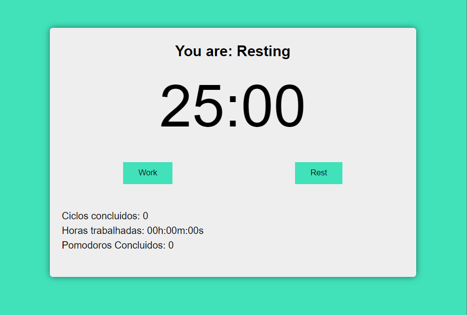
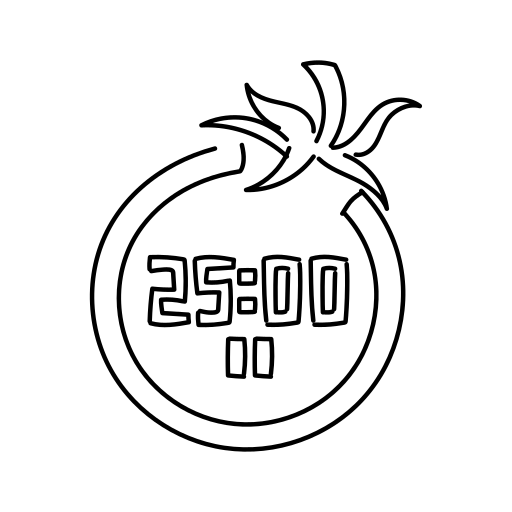

# 🍅 Pomodoro App

A pomodoro app created using Vue

## 📸 Screenshot

<a href="https://tic-tac-toe-xi-tawny.vercel.app/"  target="_blank" ></a>

## 🔗 Link -> <a href="https://tic-tac-toe-xi-tawny.vercel.app/"  target="_blank" >Click Me</a></h1>

## 📄 About

A simple Pomodoro app to help you stay focused, increase productivity and manage your work time efficiently.

## 👨‍💻 Technologies

[]()
[]()
[]()

<div>


</div>

## 🚀 Functionalities

- **Pomodoro Timer**: Set up work and rest intervals.
- **Notifications**: Receive audio alerts when timers end.
- **Activity History**: Track your progress.

## Image

<a href="https://iconscout.com/icons/pomodoro"></a>

<a href="https://iconscout.com/icons/pomodoro" class="text-underline font-size-sm" target="_blank">Pomodoro</a> by <a href="https://iconscout.com/contributors/kawalanicon" class="text-underline font-size-sm">Kawalan Studio</a> on <a href="https://iconscout.com" class="text-underline font-size-sm">IconScout</a>

## 📝 Licença

Este projeto é licenciado sob a [MIT License](./LICENSE).

## ♻️ How Use

```bash
# Clone the repository
$ git clone https://github.com/gabrielssconceicao/PomodoroApp.git
```

```bash
# Enter directory
$ cd PomodoroApp
```

```bash
# Installing dependencies, if npm
$ npm install
```
